# Architecture

## 6. Plane separation and staleness windows

### Trust boundaries (diagram 03)

Each trust zone is its own SPIFFE trust domain. The two domains meet only through the attested
channel and a TRAIN verdict; they are never merged. Data-plane calls into the management plane are
denied by default, and a workload without an SVID or running an unsigned image cannot join or
start.

Source: [`diagrams/03-trust-boundaries.mmd`](diagrams/03-trust-boundaries.mmd).

### Management-plane roles (ZT-55)

ZT-55 (SRS 3.3) names five management-plane components that must be strictly separated from the
data plane network. In this demonstrator they are reachable from the data plane only through the
paths the allow matrix below permits explicitly at both layers; those paths are dedicated control
channels (named mTLS pairs), except the observability export path, which is a declared bypass
under ZT-26. The table binds each of them,
in the order the requirement names them, to the service or services that implement it in this
demonstrator. The allow matrix below lists the dedicated control channels toward these roles and
refers to the roles by name, so coverage of the five components can be checked here before the
permitted paths are read.

Every role in the table below is bound to at least one service; none is unimplemented.

The supply boundary records who provides the software, not who deploys or operates it.
*Project-built* means this project provides the software: it builds or packages it and owns its
configuration. *Client-supplied* means the software is provided to the demonstrator by the client
as part of the XFSC stack; a client-supplied role stays client-supplied when this project deploys
and operates it, as it does for all three below. The column is kept because client-supplied
software is the demonstrator's largest external dependency: its provenance, its versions and its
interfaces are fixed outside this project. It says nothing about enforcement. The layer that
enforces a path to a role follows network topology — where the destination runs relative to its
source — not who supplies the service; see the allow matrix below.

| ZT-55 role | Implementing service(s) | Supply boundary | Evidence |
|---|---|---|---|
| Policy Engine | TSA policy engine (Trust Services API) | Client-supplied | [External XFSC components](dependencies.md#external-xfsc-components) |
| TRAIN | TCR (trust-list resolution); TSPA (trust-list publication) | Client-supplied | [External XFSC components](dependencies.md#external-xfsc-components); [TSPA in the ZT-35 flow](tspa-publish-api.md#3-what-tspa-is-in-the-zt-35-flow) |
| SPIRE control plane | SPIRE server and its controller-manager | Project-built | [Workload identity](environments/osc.md#2-workload-identity) |
| OCM | OCM W-Stack, used by the backend as the credential verification service | Client-supplied | [External XFSC components](dependencies.md#external-xfsc-components) |
| Observability stack | OpenTelemetry Collector, read through Prometheus and Jaeger | Project-built | [Operations](environments/osc.md#operations) |

### Allow matrix (data plane → management plane)

Default DENY at both layers (NetworkPolicy and mesh AuthorizationPolicy). Each ALLOW row below is
permitted explicitly at both the NetworkPolicy layer and the mesh AuthorizationPolicy layer, and
nothing else reaches the management plane. In this demonstrator, a *dedicated control channel* in
the ZT-55 sense is a named, mTLS-authenticated source → destination pair; the rows marked *named
pair* are such channels toward the roles they name. The observability export row is not a named
pair: it is permitted as a declared bypass under ZT-26, defined below the matrix. The ZT-55 role
column names the role from the table above that the destination serves. Any management-plane
destination without its own row is denied by the catch-all row.

ZT-55 (SRS 3.3) requires the separation to be enforced at both the Kubernetes network policy layer
and the service mesh layer, so every row states its disposition at both. The enforcement column
holds layers only: for each row it gives the NetworkPolicy disposition and the mesh
AuthorizationPolicy disposition, and nothing else. A permitted path is permitted explicitly at both
layers; a denied path is denied at both.

On every permitted path the **mesh waypoint** is the single L7 enforcement owner, and the
NetworkPolicy layer is held to L3/L4 for that path. Two L7 decision points on one path would make
the fail-closed behaviour ZT-55 depends on non-deterministic, so each path has exactly one
([ADR-0001](adr/0001-service-mesh-mode-istio-ambient-with-cilium.md)). The assignment is recorded
per path in the mesh configuration; this matrix reflects that record and does not replace it. If
the mesh configuration changes the owner of a path, this column changes with it.

The test column names the scenario tag that proves each row, in the form the acceptance harness
requires: the requirement row and its acceptance test identifier
([Tags](bdd.md#tags)). A tag is named here even where its scenario is not yet written — the
matrix is the specification that scenario is written from, and the traceability sheet reports the
row as uncovered until it exists.

| From data-plane workload → | ZT-55 role | Allowed? | Enforcement (NetworkPolicy; mesh AuthorizationPolicy) | Test |
|---|---|---|---|---|
| PDP adapter → TSA policy engine | Policy Engine | ALLOW (mTLS, named pair) | NetworkPolicy: ALLOW, L3/L4 only; mesh: ALLOW, L7 owner (waypoint) | `@ZT-55 @BDD-ZT-055` |
| aTLS gateway → TCR resolve | TRAIN (resolution) | ALLOW (named pair) | NetworkPolicy: ALLOW, L3/L4 only; mesh: ALLOW, L7 owner (waypoint) | `@ZT-55 @BDD-ZT-055` |
| workloads → OTel collector (export only) | Observability stack | ALLOW (declared bypass, ZT-26) | NetworkPolicy: ALLOW, L3/L4 only, egress rule limiting the source to the collector's export port (ZT-26); mesh: ALLOW, L7 owner (waypoint) | `@ZT-55 @BDD-ZT-055` |
| backend → verification service | OCM | ALLOW (named pair) | NetworkPolicy: ALLOW, L3/L4 only; mesh: ALLOW, L7 owner (waypoint) | `@ZT-55 @BDD-ZT-055` |
| any data-plane workload → TSPA (trust-list publication) | TRAIN (publication) | **DENY** | NetworkPolicy: DENY; mesh: DENY | `@ZT-55 @BDD-ZT-055` |
| any data-plane workload → SPIRE server | SPIRE control plane | **DENY** | NetworkPolicy: DENY; mesh: DENY | `@ZT-55 @BDD-ZT-055` |
| anything else data → management: any management-plane destination without its own row, including other management components (for example ArgoCD, OpenBao, Harbor, estserver, admin APIs) | any management-plane destination not listed above | **DENY** | NetworkPolicy: DENY; mesh: DENY | `@ZT-55 @BDD-ZT-055` |

**Same-cluster assumption.** The layers named above assume that the destination runs in the same
cluster as the source workload, where both are policies between namespaces. The enforcing
mechanism follows network topology rather than who supplies a service: a destination in another
cluster is reached through an egress rule, and one outside the estate through a different control
again. Placement is recorded for the SPIRE control plane and the observability stack only, so four
rows are provisional: PDP adapter → TSA policy engine, aTLS gateway → TCR resolve, backend →
verification service, and the denied row any data-plane workload → TSPA. The denied row is
included because a denial across a cluster boundary rests on a different mechanism than one within
a cluster. Once their destinations are placed, these rows will also name their egress rule.

**Declared bypass.** A *declared bypass* is a path exempted from the Zero Trust Connector under
ZT-26 (SRS 3.1.2). ZT-26 exempts protocols and endpoints not related to inter-connector
communication; the exempt classes are name resolution, observability export and cluster
administration. A declared bypass is listed with its reason and remains subject to its own ingress
and egress controls. It bypasses the Connector only — not the mesh and not the network layer — and
the term carries no other meaning in this section. The observability row above and the
name-resolution row under [Supporting services](#supporting-services-outside-the-management-plane)
are the two paths that carry it.

This matrix is not the ZT-26 bypass list, which is a separate reviewed artefact; the rows here that
carry a declared bypass are entries in that list, not the list itself. Cluster administration is
an exempt class with no row here because administrative traffic does not originate in a data-plane
workload, and the domain of this matrix is paths from the data plane to the management plane. A
data-plane workload that reaches an administrative endpoint remains denied by the catch-all row.

**Out of scope: collection initiated from the management plane.** Paths initiated from the
management plane toward a data-plane cluster, such as metric collection pulled by the
observability interfaces, are outside this matrix. ZT-55 governs reachability from the data plane,
so the matrix models that direction only.

The two TRAIN rows carry opposite verdicts on purpose. ZT-35 (SRS 3.1.3) requires any endpoint
that establishes attested TLS connections to *resolve* its peers' trusted hashes from TRAIN, so
the aTLS gateway needs a read path to TCR at run time. The same requirement assigns *publication*
to the endpoint's CI/CD pipeline, which uploads the hash on deployment; no data-plane workload
publishes. Publication writes the trust anchors that every peer relies on, so leaving it reachable
from the data plane would let a compromised data-plane workload alter trust decisions, which
ZT-55 forbids. Publication therefore stays denied from the data plane and is reached only through
the pipeline's publication path.

### Supporting services (outside the management plane)

The data plane also depends on three services that are not among the five components ZT-55
names. ZT-55 does not govern them: they are supporting services outside the management plane.
Each is permitted explicitly under the same default DENY at both layers as the matrix above, and
any other destination without a row is denied. They are not all named mTLS pairs: a service whose
traffic the mesh cannot govern is permitted by a rule at the network layer instead, and its row
says so. Where the mesh does govern a path, the mesh waypoint is its L7 owner as in the matrix
above.

These rows are proved by the acceptance families of their own requirements (see the
[scenario inventory](bdd.md#scenario-inventory)), not by the plane-separation test, so this table
carries no test column.

| From data-plane workload → | Supporting service | Allowed? | Enforcement (NetworkPolicy; mesh AuthorizationPolicy) |
|---|---|---|---|
| aTLS gateway → cmcd | attestation for the aTLS channel | ALLOW (named pair) | NetworkPolicy: ALLOW, L3/L4 only; mesh: ALLOW, L7 owner (waypoint) |
| workloads → DNS | name-resolution infrastructure | ALLOW (declared bypass, ZT-26) | NetworkPolicy: ALLOW, port 53 only; mesh: not applicable — DNS is not mTLS traffic, so the mesh cannot govern it |
| backend → Keycloak token endpoint | identity and token issuance | ALLOW (named pair) | NetworkPolicy: ALLOW, L3/L4 only; mesh: ALLOW, L7 owner (waypoint), token endpoint only |

- **aTLS gateway → cmcd — attestation for the aTLS channel.** cmcd is the per-zone attestation
  service beside the gateway. The attested channel between the zones requires both ends to present
  evidence of the software they run, bound to the TLS connection it is presented on
  ([trust boundary between the zones](environments/osc.md#6-the-trust-boundary-between-the-zones)).
  That evidence comes from CMC (ZT-31, ZT-71; [specifications](specifications.md)), and cmcd is
  the per-zone CMC service that receives the pipeline-signed reference metadata the evidence is
  checked against. Without this path the gateway cannot establish attested TLS as ZT-35
  (SRS 3.1.3) requires.
- **workloads → DNS — name-resolution infrastructure.** DNS is cluster infrastructure. Data-plane
  workloads reach the destinations permitted above by service name, so without name resolution
  none of those paths can be used. The path is a declared bypass under ZT-26, in the sense defined
  above, and is permitted by a NetworkPolicy rule limited to port 53. It is not a named mTLS pair:
  DNS is not mTLS traffic, so the mesh layer does not apply and the network layer imposes the
  restriction.
- **backend → Keycloak token endpoint — identity and token issuance.** Keycloak is the
  demonstrator's identity provider (ZT-21, ZT-22; [Keycloak integration](keycloak.md)), and its
  token endpoint is where tokens from that provider are issued. The path is limited to the token
  endpoint for the backend as a named pair.

### Staleness matrix

Maximum window in which a revoked or rotated artefact still authorises. All values are proposed.

| Artefact | Rotation/lifetime | Cache | Max stale-authorisation window |
|---|---|---|---|
| SVID | 1 h TTL | in-process | ≤ 1 h (mesh) |
| Keycloak/issuer JWKS | rotate on demand | guard cache 5 min | ≤ 5 min |
| Access token | 300 s lifetime | — | ≤ 300 s after revocation of its basis |
| Policy bundle | poll 60 s | TSA cache | ≤ 60 s |
| Trust list / measurement | TTL 300 s | TCR/gateway | ≤ 300 s + channel lifetime 15 min ⇒ ≤ ~20 min for an established channel (bounded by channel re-establishment) |
| Credential revocation | checked per verification | outcome TTL 120 s | ≤ renewal interval (≤ token lifetime 300 s) + 120 s |
